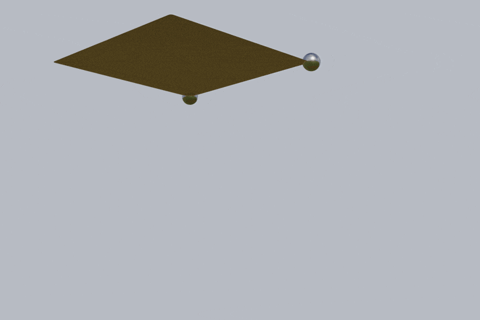
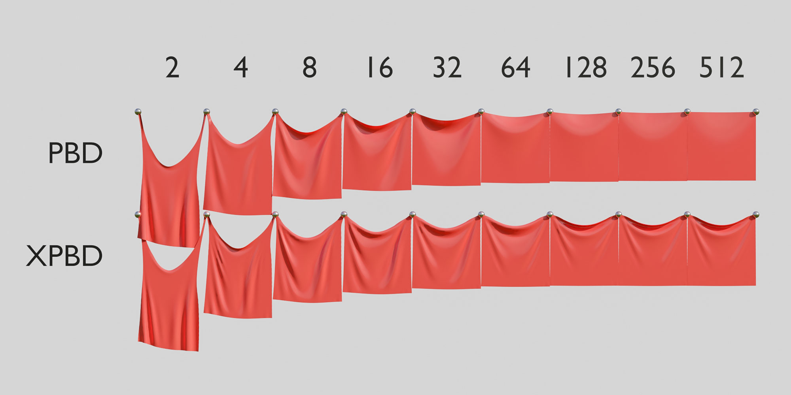

# elasty


A research-oriented elastic body simulator



## Algorithms

### Frameworks

- [x] Position-based dynamics (PBD) [Müller+07]
- [x] Extended position-based dynamics (XPBD) [Macklin+16]
- [ ] Small-steps XPBD [Macklin+19]
- [ ] Projective dynamics [Bouaziz+14]
- [ ] Quasi-Newton dynamics [Liu+17]
- [ ] ...

### Constraints for PBD/XPBD

- [ ] Area conservation constraint [Müller+14]
- [x] Bending constraint [Müller+07]
- [ ] Continuum-tetrahedron constraint [Bender+14]
- [x] Continuum-triangle constraint [Bender+14]
- [x] Distance constraint [Müller+07]
- [x] Environmental collision constraint
- [ ] Example-based shape matching constraint [Koyama+12]
- [x] Fixed point constraint
- [x] Isometric bending constraint [Bergou+06; Bender+14]
- [ ] Long range attachments constraint [Kim+12]
- [x] Shape matching constraint [Müller+05]
- [ ] Tetrahedron strain constraint [Müller+14]
- [ ] Triangle strain constraint [Müller+14]
- [ ] Volume conservation constraint [Müller+14]
- [ ] ...

## Additional Features

- Export simulated cloth meshes as Alembic

## Dependencies

### Core Library

- Alembic <https://github.com/alembic/alembic> [BSD 3-Clause]
  - OpenEXR <https://github.com/openexr/openexr> [BSD 3-Clause]
- Eigen <http://eigen.tuxfamily.org/> [MPL2]
- tinyobjloader <https://github.com/syoyo/tinyobjloader> [MIT]

### Demos

- bigger <https://github.com/yuki-koyama/bigger> [MIT]
  - bigg <https://github.com/JoshuaBrookover/bigg> [Unlicense]
    - bgfx.cmake <https://github.com/JoshuaBrookover/bgfx.cmake> [CC0]
      - bgfx <https://github.com/bkaradzic/bgfx> [BSD 2-Clause]
      - bimg <https://github.com/bkaradzic/bimg> [BSD 2-Clause]
      - bx <https://github.com/bkaradzic/bx> [BSD 2-Clause]
    - Dear ImGui <https://github.com/ocornut/imgui> [MIT]
    - GLFW <https://github.com/glfw/glfw> [Zlib]
    - GLM <https://github.com/g-truc/glm> [MIT]
  - random-util <https://github.com/yuki-koyama/rand-util> [MIT]
  - string-util <https://github.com/yuki-koyama/string-util> [MIT]
  - tinyobjloader <https://github.com/syoyo/tinyobjloader> [MIT]
- timer <https://github.com/yuki-koyama/timer> [MIT]

### Tests

- googletest <https://github.com/google/googletest> [BSD 3-Clause]

## Prerequisites

macOS:
```bash
brew install eigen openexr
```

Ubuntu 16.04:
```bash
apt install libeigen3-dev openexr
```

## Build

```bash
git clone https://github.com/yuki-koyama/elasty.git --recursive
mkdir build
cd build
cmake ../elasty
make
```

## Gallery

### PBD vs. XPBD

The constraint stiffnesses in PBD [Müller+07] are dependent on the number of iterations for constraint solving. As the number of iterations increases, the constraints become infinitely stiff regardless of the `stiffness` parameters. This issue makes the parameter tuning difficult.

XPBD [Macklin+16] resolves this issue. As the number of iterations increases, the constraint stiffnesses converge to some (non-infinitely-stiff) states in accordance with the `compliance` parameters. This property makes the parameter tuning easier and more consistent.



These simulated results were generated by `examples/pbd-xpbd-comparison/main.cpp`.

## License

MIT License

## Contributing

Issue reports and pull requests are highly welcomed.

## References

- __[Bender+14]__ Jan Bender, Dan Koschier, Patrick Charrier, and Daniel Weber. 2014. Position-based simulation of continuous materials. Comput. Graph. 44 (2014), 1-10. DOI: http://doi.org/10.1016/j.cag.2014.07.004
- __[Bender+17]__ Jan Bender, Matthias Müller, and Miles Macklin. 2017. A survey on position based dynamics, 2017. In Proc. Eurographics '17 Tutorials, Article 6, 31 pages. DOI: https://doi.org/10.2312/egt.20171034
- __[Bergou+06]__ (TODO)
- __[Bouaziz+14]__ Sofien Bouaziz, Sebastian Martin, Tiantian Liu, Ladislav Kavan, and Mark Pauly. 2014. Projective dynamics: fusing constraint projections for fast simulation. ACM Trans. Graph. 33, 4 (2014), 154:1--154:11. DOI: https://doi.org/10.1145/2601097.2601116
- __[Kim+12]__ (TODO)
- __[Koyama+12]__ Yuki Koyama, Kenshi Takayama, Nobuyuki Umetani, and Takeo Igarashi. 2012. Real-time example-based elastic deformation. In Proc. SCA '12, 19-24. DOI: https://doi.org/10.2312/SCA/SCA12/019-024
- __[Liu+17]__ Tiantian Liu, Sofien Bouaziz, and Ladislav Kavan. 2017. Quasi-Newton methods for real-time simulation of hyperelastic materials. ACM Trans. Graph. 36, 3 (2017), 23:1--23:16. DOI: https://doi.org/10.1145/2990496
- __[Macklin+16]__ Miles Macklin, Matthias Müller, and Nuttapong Chentanez. 2016. XPBD: position-based simulation of compliant constrained dynamics. In Proc. MIG '16, 49-54. DOI: https://doi.org/10.1145/2994258.2994272
- __[Macklin+19]__ Miles Macklin, Kier Storey, Michelle Lu, Pierre Terdiman, Nuttapong Chentanez, Stefan Jeschke, and Matthias Müller. 2019. Small steps in physics simulation. In Proc. SCA '19, 2:1–2:7. DOI: https://doi.org/10.1145/3309486.3340247
- __[Müller+05]__ Matthias Müller, Bruno Heidelberger, Matthias Teschner, and Markus Gross. 2005. Meshless deformations based on shape matching. ACM Trans. Graph. 24, 3 (2005), 471-478. DOI: https://doi.org/10.1145/1073204.1073216
- __[Müller+07]__ Matthias Müller, Bruno Heidelberger, Marcus Hennix, and John Ratcliff. 2007. Position based dynamics. J. Vis. Comun. Image Represent. 18, 2 (2007), 109-118. DOI: https://doi.org/10.1016/j.jvcir.2007.01.005
- __[Umetani+14]__ Nobuyuki Umetani, Ryan Schmidt, and Jos Stam. 2014. Position-based elastic rods. In Proc. SCA '14, 21-30. DOI: https://doi.org/10.2312/sca.20141119
- (TODO)
